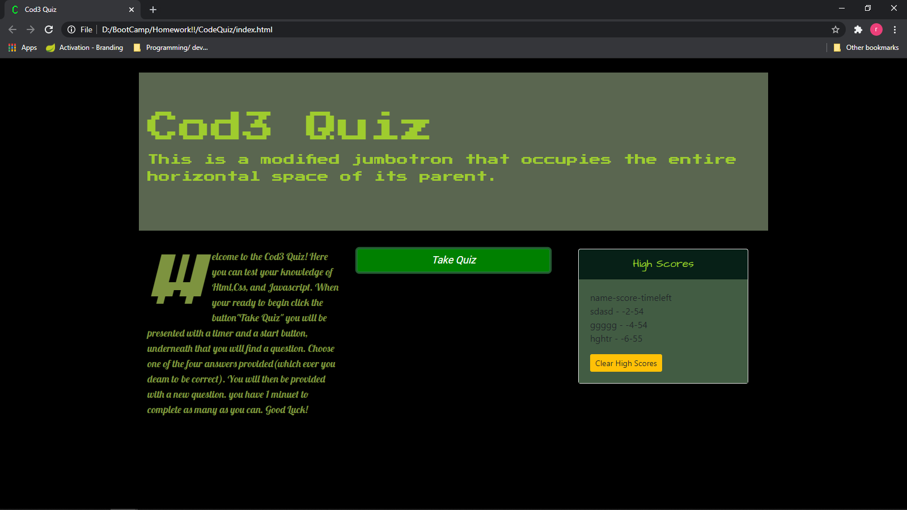
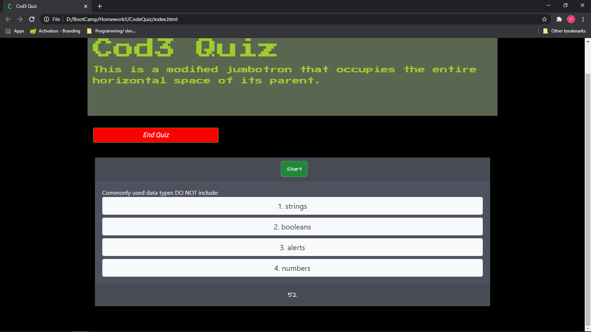
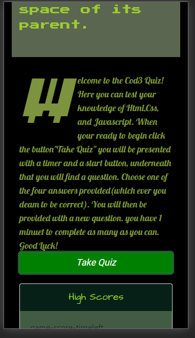

# CodeQuiz

## *Objective* 
To create a quiz that updates the dom and stores scores locally
### Method
created an html page with default elements that scale depending on media size
then procuced styling for such elements
after created scripts to updae, change, and store information to and from the page.

 
 
 

### Usage 
 A starter place for quiz/tests, knowledge checks or for study.

### Instalation
To make the project work you will need -
* an editor or ide that will save file in the proper types*(html,css,javascript)*  
`Visual Studio or Visual Studio Code` will work great.
* using a version control system you can fork and clone my repo, you could also 
just download the files directly for git hub.

### Deployed website and screenshots

[Link](https://rickycohen88.github.io/CodeQuiz/)

### Credits
* Trillogy Education
* sound boards 101

### Contributing
Pull requests are welcome. For major changes, 
please open an issue first to discuss what you would like to change. 
 Please make sure to update tests as appropriate.

### License

    © 